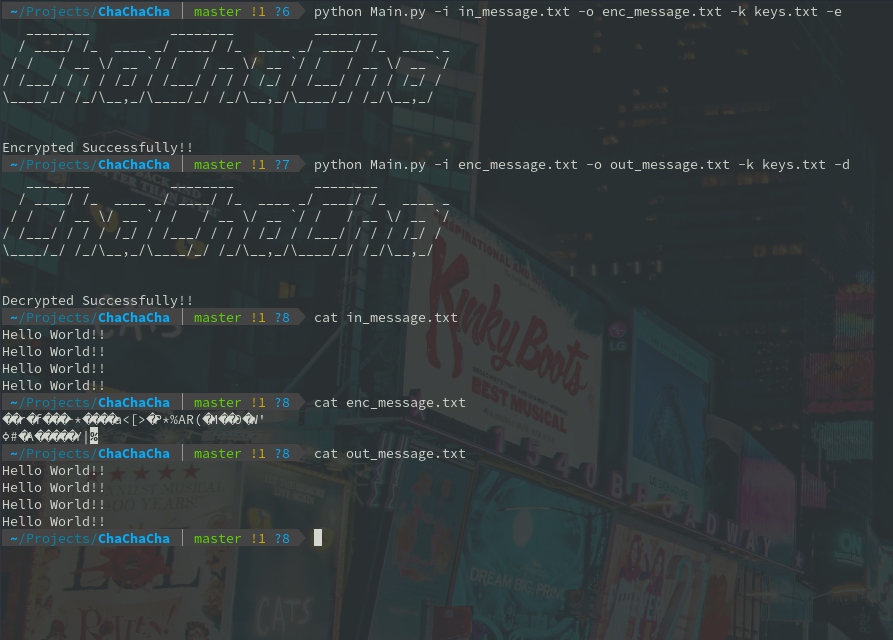
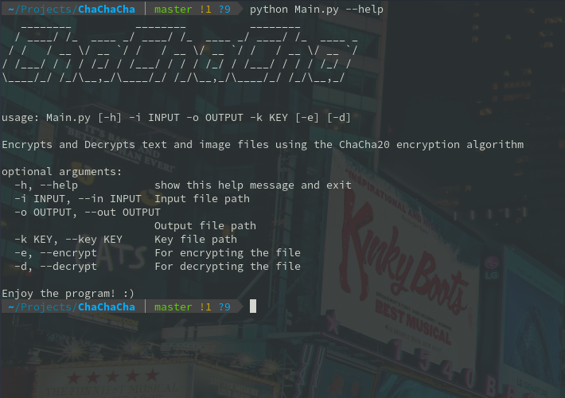

# ChaChaCha

ChaChaCha is a simple command-line interface tool wihch uses the ChaCha20 algorithm to encrypt text and image files. 

## Features-

- Change or modify keys and nonce values easily by changing contents of the file containing them
- Can encrypt and decrypt both image and text files.

## Built using-

- [Argparse](https://docs.python.org/3/library/argparse.html) - For creating the CLI tool
- [Pyfiglet](https://pypi.org/project/pyfiglet/0.7/) - For rendering ASCII art fonts 

## Directions for Setting up Environment-

To install the source, pre-requisites include-
- Python 3.6 or above
- Dependencies from requirements.txt

First, clone this repository onto your system. Then, create a virtual enviromnent-
```
cd path/to/folder
virtualenv venv -p python 3.6   // or any other name and version
```

Now, install the python dependencies from requirements.txt:
```
pip install -r requirements.txt
```

## Usage-

Use the '-h' or the '--help' flag in order to see the usage and required arguments of the tool.

| Flag | Description |
| --- | ------------ |
| -i, --in | Input path to the text or image file |
| -o, --out | Output path to the text or image file |
| -k, --key | Path to file containing keys and nonce |
| -e, --encrypt | For encrypting the file |
| -d, --decrypt | For decrypting the file |
| -h, --help | Show the help message and exit | 




